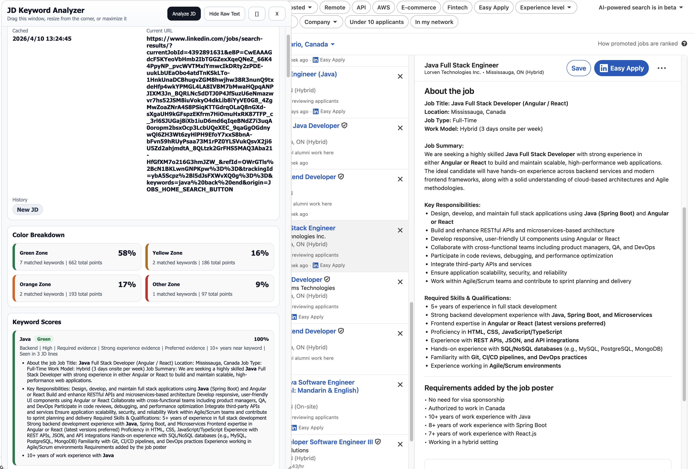
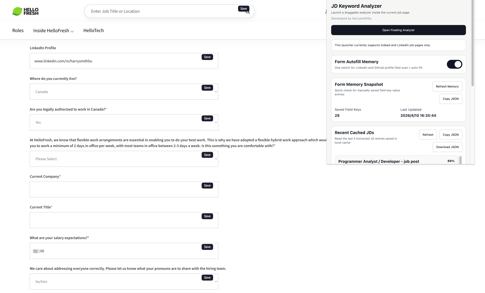

# JD Keyword Analyzer MVP

This folder now contains a first-pass Chrome extension MVP for analyzing job descriptions on LinkedIn and Indeed.

## What this version does

- Installs in Chrome as an unpacked extension
- Opens from the browser toolbar as a popup
- Reads the current page when you click `Analyze JD`
- Expands likely collapsed job description sections before reading
- Extracts job description text from LinkedIn and Indeed selectors, then falls back to the largest main content block
- Scores the tracked keywords with lightweight text matching
- Shows a score, signal level, and supporting sentence snippets for each keyword
- Restores cached analysis automatically when you reopen the same job page

## Screenshot

### 1. Floating JD Analyzer

This floating panel runs directly on LinkedIn/Indeed job pages. It extracts JD text, computes keyword scores, shows color-zone breakdown, and presents matched JD snippets for quick apply/no-apply decisions.

### 2. Popup Launcher + Form Memory

This popup panel is the control center: launch the floating analyzer, toggle form autofill memory, review saved field-key cache, and export recent cached JD analysis JSON for reuse or tuning.

## Files

- `manifest.json`: Chrome MV3 entrypoint
- `popup.html`: minimal extension UI
- `popup.css`: plain popup styling
- `popup.js`: popup actions, page extraction trigger, rendering
- `keywords.js`: tracked keyword list and aliases
- `scorer.js`: rule-based scoring logic

## How to load it in Chrome

1. Open `chrome://extensions`
2. Enable `Developer mode`
3. Click `Load unpacked`
4. Select this folder:
   `/Users/harryliu/Documents/workspace/portfolio/pj-tool-jobs/plugin-jobs`

## How to use it

1. Open a job page on LinkedIn or Indeed
2. Click the extension icon
3. Click `Analyze JD`
4. Review the overall signal, per-keyword scores, and matching snippets

## Version 1 delivery batches

### Batch 1: Installable scoring MVP

Goal: prove the end-to-end path works.

- Installable Chrome extension
- Popup UI
- Button-triggered JD extraction
- Rule-based keyword scoring
- Snippet-based result display

Status: implemented in this folder

### Batch 2: Extraction hardening

Goal: make LinkedIn and Indeed extraction more stable.

- Add more site-specific selectors
- Expand hidden/collapsed description text before reading
- Cache prior analysis by URL
- Improve job title and company extraction

Status: implemented in this folder

### Batch 3: Better scoring quality

Goal: reduce obvious false positives and make scores easier to trust.

- Add more aliases and phrase variants
- Distinguish required vs preferred wording more precisely
- Track nearby year requirements per keyword
- Add group summaries such as Backend / Frontend / Infra

### Batch 4: Application form memory

Goal: save time once you decide to apply.

- Detect fields on application pages
- Save answers by question fingerprint
- Offer one-click fill suggestions
- Store reusable personal profile fields

## Current limits

- This is still rule-based matching, so the score is a screening signal, not ground truth
- Site HTML changes can break extraction selectors
- Some pages load content lazily, so an occasional re-run may still be needed
